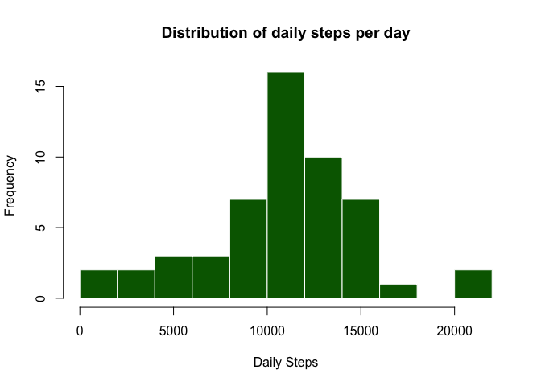
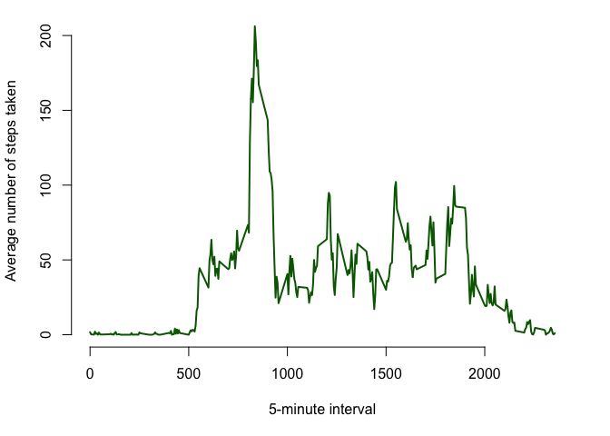
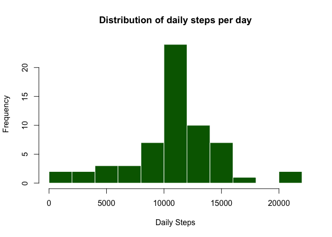

# Reproducible Research: Peer Assessment 1
This is my markdown file for solving Course Project 1 from Reproducible Research course, fourth in Data Science Specialization by Coursera - John Hopkins University.

This project objective is to learn to use R markdown files and knitr through the analysis of personal movement data, in the form of number of steps per 5-minute intervals, registered during 2 months. Let's see which conclusions can we draw from this.
<br><br>

## Loading and preprocessing the data

We'll start by loading the data and check its contents


```r
data <- read.csv("activity.csv")
str(data)
```

```
## 'data.frame':	17568 obs. of  3 variables:
##  $ steps   : int  NA NA NA NA NA NA NA NA NA NA ...
##  $ date    : Factor w/ 61 levels "2012-10-01","2012-10-02",..: 1 1 1 1 1 1 1 1 1 1 ...
##  $ interval: int  0 5 10 15 20 25 30 35 40 45 ...
```

Looks usable enough.
<br><br>

## What is mean number of steps taken per day?

We will ignore the missing values for now. Let's histogram the total steps taken per day.


```r
daily.steps <- with(data, tapply(steps, date, sum))
hist(daily.steps, breaks = 10,
     xlab = "Daily Steps", main = "Distribution of daily steps per day",
     col = "darkgreen", border = "white")
```

<!-- -->

Looks about right. Let's take the mean and median for this distribution.


```r
cat("The mean is", format(round(mean(daily.steps, na.rm = TRUE), 0), big.mark = ","), "and the median is", format(round(median(daily.steps, na.rm = TRUE), 0), big.mark = ","), ".")
```

```
## The mean is 10,766 and the median is 10,765 .
```

They are quite close!
<br><br>

## What is the average daily activity pattern?

Now we need to plot a time series containing the average number of steps per each 5-minute interval. We'll keep ignoring NAs.


```r
int.ave <- with(data, aggregate(steps, by = list(interval), mean, na.rm = TRUE))
names(int.ave) <- c("interval", "steps")
par(mar=c(5.1,4.1,0.8,2.1))
with(int.ave, plot(interval, steps, type = "l", col = "darkgreen", lwd = 2, bty = "n",
     xlab = "5-minute interval", ylab = "Average number of steps taken"))
```

<!-- -->

So, not many steps during sleep hours (surprise, surprise!). Interesting spike between 8am and 9am. Morning jogs, or just rushing to work? Let's see the exact interval.


```r
cat("Max average of steps taken is at", int.ave$interval[which.max(int.ave$steps)], ".")
```

```
## Max average of steps taken is at 835 .
```
<br>

## Imputing missing values

Now, sooner or later we'll have to do something with those NAsty guys. Counting them would help.


```r
NAs <- sum(is.na(data$steps))
paste("The number of NAs is ", format(NAs, big.mark = ","), ", which represents a ", round(NAs/dim(data)[1]*100,1), "% of our data.", sep = "")
```

```
## [1] "The number of NAs is 2,304, which represents a 13.1% of our data."
```

Quite a lot of NAs! We'll just substitute them for the average steps on each 5-minute interval, and store the result in a new data frame.


```r
data2 <- data
# get interval of each missing value
naintervals <- data2$interval[is.na(data2$steps)]
# index these intervals in data frame containing averages
naintervals <- match(naintervals, int.ave$interval)
# substitute
data2$steps[is.na(data2$steps)] <- int.ave$steps[naintervals]
str(data2)
```

```
## 'data.frame':	17568 obs. of  3 variables:
##  $ steps   : num  1.717 0.3396 0.1321 0.1509 0.0755 ...
##  $ date    : Factor w/ 61 levels "2012-10-01","2012-10-02",..: 1 1 1 1 1 1 1 1 1 1 ...
##  $ interval: int  0 5 10 15 20 25 30 35 40 45 ...
```

```r
# just to be sure...
NAs <- sum(is.na(data2$steps))
paste("The number of NAs is ", format(NAs, big.mark = ","), ", which represents a ", round(NAs/dim(data)[1]*100,1), "% of our data.", sep = "")
```

```
## [1] "The number of NAs is 0, which represents a 0% of our data."
```

Better now :) Let's recalculate mean steps per day with NAs corrected.


```r
daily.steps <- with(data2, tapply(steps, date, sum))
hist(daily.steps, breaks = 10,
     xlab = "Daily Steps", main = "Distribution of daily steps per day",
     col = "darkgreen", border = "white")
```

<!-- -->

```r
cat("The mean is", format(round(mean(daily.steps, na.rm = TRUE), 0), big.mark = ","), "and the median is", format(round(median(daily.steps, na.rm = TRUE), 0), big.mark = ","), ".")
```

```
## The mean is 10,766 and the median is 10,766 .
```

As expected, mean and median stay almost the same, while histogram shows us that we are increasing average days (remember that we have substituted NAs by interval-averages!).
<br><br>

## Are there differences in activity patterns between weekdays and weekends?

Time to analyze different patterns when we are working or not. Let's add the weekday/weekend factor to our new data frame.


```r
data2$wkd <- weekdays(as.Date(data2$date))
data2$wkd[data2$wkd == "dissabte" | data2$wkd == "diumenge"] <- "weekend"
data2$wkd[data2$wkd != "weekend"] <- "weekday"
table(data2$wkd)
```

```
## 
## weekday weekend 
##   12960    4608
```

So far so good. Now we must plot the average steps per interval in two panels, each of them containing the data on each kind of day.


```r
wd.ave <- with(subset(data2, data2$wkd == "weekday"), aggregate(steps, by = list(interval), mean))
we.ave <- with(subset(data2, data2$wkd == "weekend"), aggregate(steps, by = list(interval), mean))
names(wd.ave) <- c("interval", "steps"); names(we.ave) <- c("interval", "steps")
par(mfrow = c(2,1), mar=c(4,6,0,0))
with(wd.ave, plot(interval, steps, type = "l", col = "darkgreen", lwd = 2, bty = "n",
     xlab = "", ylab = "Avg number of steps\n taken on weekdays"))
with(we.ave, plot(interval, steps, type = "l", col = "darkgreen", lwd = 2, bty = "n",
     xlab = "5-minute interval", ylab = "Avg number of steps\n taken on weekends"))
```

<!-- -->

We see that normal days show a morning spike and low-step working hours, while weekends have activity shared throughout the day. Assignment finished!
